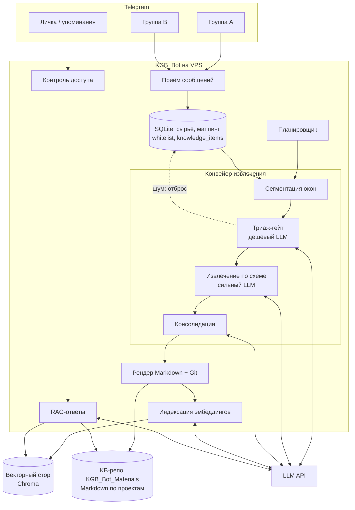
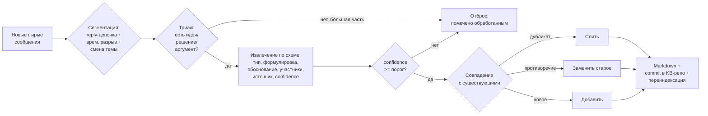
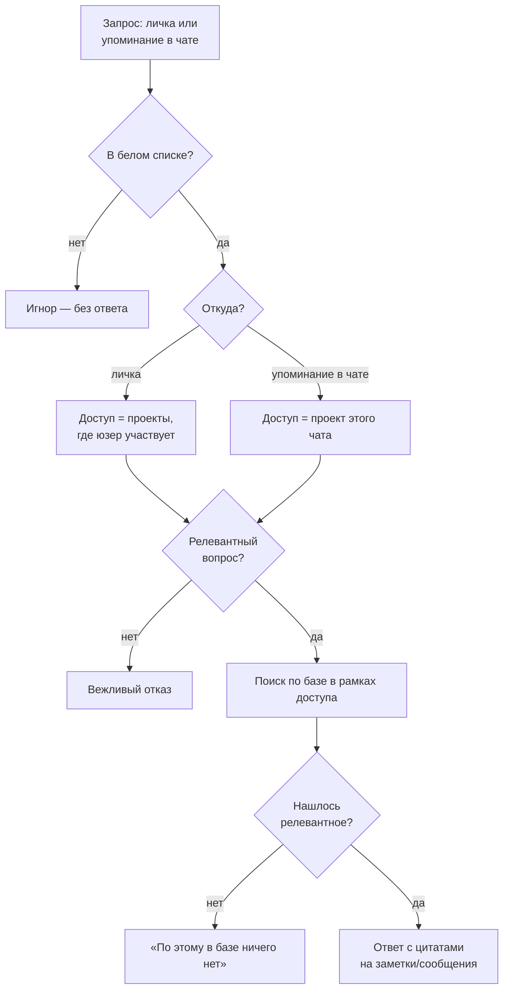

# KGB_Bot — Telegram-бот базы знаний

Telegram-бот, который **пассивно слушает рабочие чаты, вычленяет из обсуждений идеи, решения и аргументы и превращает их в структурированную базу знаний**, а затем по запросу отвечает на вопросы по этой базе — с цитатами на источники и строгим контролем доступа.

> **Статус:** проектирование/ранняя реализация. Полный технический план — [`docs/plans/2026-06-17-001-feat-telegram-knowledge-bot-plan.md`](docs/plans/2026-06-17-001-feat-telegram-knowledge-bot-plan.md). Этот README объясняет, **как всё устроено и почему**; план — что и в каком порядке реализуется.

- **Репозиторий кода:** `KGB_Bot`
- **Репозиторий базы знаний (выжимки):** `KGB_Bot_Materials` — отдельный, **приватный**
- **Где работает:** VPS (Linux, systemd), активность — в Telegram

---

## Зачем это нужно

Команда обсуждает работу в множестве Telegram-чатов. Ценные **решения, идеи и аргументы тонут в потоке сообщений**: их нельзя быстро найти, восстановить «почему мы так решили», или дать новому участнику выжимку. Ручное ведение вики не происходит — нет дисциплины и времени.

Бот делает это сам: без участия людей превращает поток обсуждений в структуру знаний, по запросу отдаёт выжимку или отвечает на вопрос, и ограничивает доступ так, чтобы каждый видел только знания тех проектов, к которым причастен.

**Главная сложность, вокруг которой построена вся система, — качество извлечения:** отделить смысл от шума и не дать базе превратиться в свалку дубликатов.

---

## Ключевые принципы

1. **Сбор через официальный Bot API**, а не userbot. Стабильно и без риска бана аккаунта. Следствие: живую историю Bot API не отдаёт (бот видит сообщения только после добавления) — стартовая история подтягивается **разовым импортом Telegram-экспорта**.
2. **Двухстадийное извлечение: дешёвый триаж → дорогое извлечение.** Маленькая модель отсеивает шум (бо́льшую часть окон), сильная модель работает только по тому, что прошло триаж. Это главный рычаг и качества, и стоимости.
3. **Извлечение по окнам разговора, а не по отдельным сообщениям.** Смысл живёт в обмене репликами (reply-цепочка + временной разрыв + смена темы), а не в одной строке.
4. **Markdown-в-Git — источник правды; векторный индекс — производный слой.** Заметки человекочитаемы, версионируемы и переживают пересборку индекса. Индекс в любой момент пересобирается из БД.
5. **Консолидация, а не накопление.** Новый элемент сверяется с существующими: дубликат сливается, обновление помечает старое как устаревшее (с защитой от ложного затирания). База уплотняется, а не растёт линейно с трафиком.
6. **Доступ — по проектам, по белому списку.** Кто не в белом списке — игнорируется полностью. Кто в нём — видит знания тех проектов, в чьих чатах он состоит.
7. **Заземлённые ответы с цитатами.** Если в базе нет релевантного — бот честно говорит «нет данных», без догадок. Каждый ответ ссылается на конкретные заметки/сообщения.
8. **Безопасность ингеста по умолчанию.** Сбор идёт только из санкционированных (привязанных админом) чатов и под жёстким бюджетом — несанкционированный чат до LLM не доходит вовсе.

---

## Как это работает

### Общая архитектура



### 1. Сбор (пассивный)

Бот добавляется в рабочие чаты. Чтобы он видел все сообщения, у него выключают privacy mode (через @BotFather) или делают админом. Каждое сообщение из **привязанного** чата сохраняется в локальную БД (SQLite) как сырьё. Из непривязанных чатов сообщения **не сохраняются** (см. «Защита»).

При первом подключении к чату бот постит уведомление о том, что записывает и извлекает знания; любой участник может исключить себя командой `/optout`.

### 2. Извлечение знаний (где режется шум)

Периодически (по порогу новых сообщений или по расписанию) запускается конвейер. Ключевая идея — **несколько дешёвых фильтров перед дорогим извлечением**, плюс консолидация:



- **Сегментация:** поток режется на связные единицы разговора, а не на отдельные сообщения.
- **Триаж (дешёвый шумогаситель):** маленькая модель решает, есть ли в окне вообще смысл. Приветствия, логистика, реакции, оффтоп → отбрасываются.
- **Извлечение по жёсткой схеме:** сильная модель достаёт структурированные элементы `{тип: идея|решение|аргумент, формулировка, обоснование, участники, ссылки на источники, confidence}`. Что не лезет в схему или ниже порога уверенности — отбрасывается.
- **Консолидация:** новый элемент сверяется с существующими по смыслу. Дубликат — сливается; обновление/противоречие — старое помечается устаревшим (но остаётся доступным по запросу); иначе — добавляется. Замена срабатывает только при явном подтверждённом противоречии, чтобы не затереть валидное знание.

Извлечённые знания записываются в Markdown по проектам, коммитятся в KB-репозиторий и переиндексируются в векторное хранилище.

### 3. Хранение знаний

- **Источник правды — Markdown в Git** (`KGB_Bot_Materials`): по файлу на тип в каждом проекте (`decisions.md`, `ideas.md`, `arguments.md`, `index.md`). Человекочитаемо, версионируемо, с историей.
- **Векторный индекс (Chroma)** — производный слой для семантического поиска; в любой момент пересобирается из БД.

### 4. Ответы на вопросы



- **В личке** whitelisted-пользователь спрашивает — бот отвечает по базе тех проектов, в которых пользователь участвует.
- **В чате** бот отвечает только при явном упоминании (`@bot вопрос`), в рамках проекта этого чата.
- Поиск всегда ограничен доступом пользователя; ответ собирается **только из найденных фрагментов** и сопровождается цитатами. Нет релевантного — честное «нет данных».

---

## Модель доступа

- **Глобальный белый список.** Не в списке → бот **полностью игнорирует** (ни ответа, ни реакции).
- **Единица доступа — проект.** Проект — это набор чатов. Пользователь видит знания проекта, если состоит **хотя бы в одном** его чате (или ему выдан доступ к проекту админом). Это решает онбординг: новичок, добавленный в один чат проекта, сразу получает доступ ко всей базе проекта.
- **Проверка членства** идёт через Telegram API по запросу (Bot API не отдаёт список участников целиком), с кэшированием; при выходе из чата доступ снимается. Перебор чатов проекта короткозамкнут — как только подтверждён один чат, проект открыт.
- **Админ-команды** (только в личке, только для админов): управление белым списком, проектами, привязкой чатов, импортом истории, ручным запуском извлечения.

---

## Защита и приватность

- **Только санкционированные чаты.** Бот собирает и обрабатывает сообщения **только из чатов, явно привязанных админом к проекту**. Если бота добавили в произвольный чат — сообщения не сохраняются и до LLM не доходят (нулевая стоимость), бот шлёт уведомление «не авторизован». Это закрывает атаку «добавили бота и залили контент, чтобы слить токены».
- **Бюджет на извлечение.** Per-chat и глобальный потолок сообщений/токенов за период; при превышении — пауза извлечения по чату и алерт админу. Даже флуд в привязанном чате упирается в бюджет.
- **Контроль доступа на уровне поиска.** Фрагменты из чужих проектов не попадают в ответ — фильтр применяется на этапе поиска, плюс дополнительная проверка перед сборкой ответа.
- **Защита от prompt-injection.** Контент сообщений передаётся в LLM строго как данные (в роли user, в делимитированном блоке), а контроль доступа держится вне промпта.
- **Согласие.** Анонс записи при добавлении бота + `/optout` для исключения своих сообщений.
- **Секреты.** Токены — в `.env` (не коммитится, права `0600` на сервере). Креды KB-репо — узкоскоупленные (deploy key / fine-grained PAT только на этот репозиторий). **KB-репо обязан быть приватным.**
- **Осознанный компромисс:** содержимое чатов уходит во внешний LLM (OpenAI/OpenRouter). Путь отхода — локальная модель (Ollama) при том же интерфейсе; при чувствительных данных — включить у провайдера политику no-training / zero-retention.

---

## Технологический стек

- **Python 3.11+**, **aiogram** (async Telegram Bot API)
- **SQLite** — сырьё, маппинг чат↔проект↔пользователь, элементы знаний (источник для пересборки индекса)
- **Chroma** — встроенное векторное хранилище (семантический поиск)
- **LLM через OpenAI-совместимый клиент** — четыре роли: триаж, извлечение, ответы, эмбеддинги. Старт на OpenAI; переключение на OpenRouter — смена `base_url` + ключа (см. план, KTD8a)
- **Git** — синхронизация базы знаний в `KGB_Bot_Materials`
- **systemd** — запуск на VPS

---

## Структура репозитория

```text
KGB_Bot/
  pyproject.toml
  .env                      # секреты (не коммитится)
  README.md                 # этот файл
  src/secretary_bot/
    config.py               # конфиг из env: токены, модели, пороги
    logging.py
    db/                     # схема SQLite + репозитории
    telegram/               # бот, приём сообщений, админ-команды,
                            # запросы, контроль доступа
    pipeline/               # сегментация, триаж, извлечение,
                            # консолидация, планировщик, импорт истории
    knowledge/              # рендер Markdown + Git, векторный индекс + поиск
    qa/                     # сборка ответа (RAG)
    llm/                    # обёртка над LLM
  tests/
  deploy/
    secretary-bot.service   # systemd unit
    RUNBOOK.md              # развёртывание на VPS, секреты, эксплуатация
```

База знаний (`KGB_Bot_Materials`):

```text
projects/
  <проект>/
    decisions.md            # решения
    ideas.md                # идеи
    arguments.md            # аргументы
    index.md                # оглавление проекта
```

---

## Конфигурация

Все секреты и настройки — в `.env`. Скопируйте шаблон и заполните:

```bash
cp .env.example .env
```

Минимум для запуска (в `.env`):

```dotenv
TELEGRAM_BOT_TOKEN=   # токен от @BotFather
OPENAI_API_KEY=       # ключ OpenAI (или OpenRouter — поменяв OPENAI_BASE_URL)
```

Для выгрузки знаний в отдельный приватный репозиторий заполните `KB_REPO_URL` +
`KB_REPO_DEPLOY_KEY_PATH` (или `KB_REPO_TOKEN`); первого админа задаёт `ADMIN_USER_ID`.
Все ключи задокументированы в [`.env.example`](.env.example). Файл `.env` в Git не попадает (см. `.gitignore`).

После заполнения токенов: у бота в @BotFather нужно **выключить privacy mode** (или сделать его админом чата) и переподключить к уже существующим чатам — смена privacy mode применяется только при (пере)входе в группу.

---

## Запуск и эксплуатация

Развёртывание на VPS, управление секретами, подключение KB-репо, бэкап и мониторинг описаны в [`deploy/RUNBOOK.md`](deploy/RUNBOOK.md) (создаётся на этапе деплоя). Кратко: один async-процесс под systemd, `.env` с правами `0600`, KB-репо через узкоскоупленный deploy key / PAT.

---

## План реализации

Работа разбита на фазы (детали — в [плане](docs/plans/2026-06-17-001-feat-telegram-knowledge-bot-plan.md)):

1. **Walking skeleton (сбор → база):** приём сообщений, извлечение, запись Markdown в Git. Без контроля доступа и ответов — чтобы рано увидеть качество извлечения на реальном трафике.
2. **Доступ, ответы, сидирование:** белый список, скоупинг по проектам, RAG-ответы, импорт истории.
3. **Качество, оркестрация, деплой:** консолидация, планировщик с реконсайлом и бюджетом, развёртывание.

---

## Лицензия

MIT — берите, используйте, форкайте; сохраните копирайт. См. [LICENSE](LICENSE).
